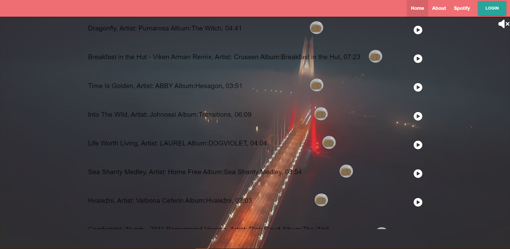
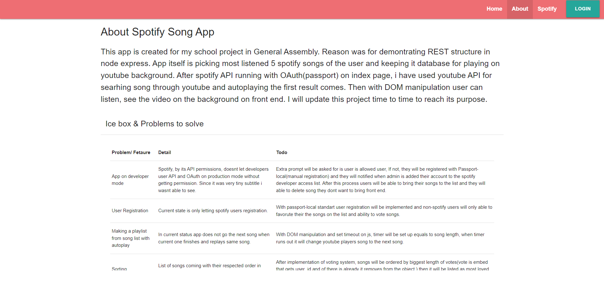
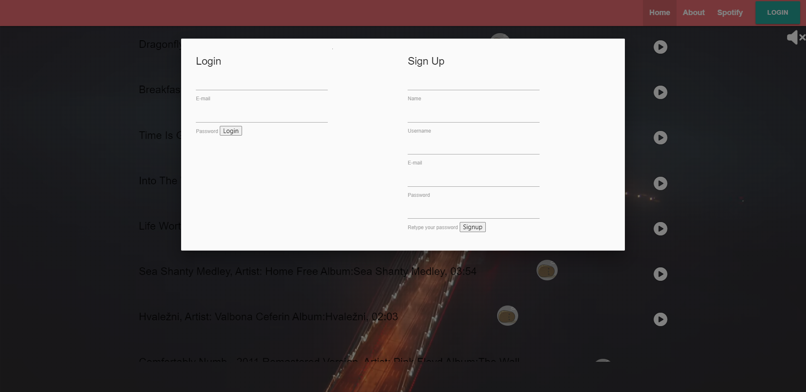

<h1> Spotify Best Songs Picker(API, NODE/EXPRESS/MONGO) </h1>

Project is prepared for demonstrating getting data from spotify with OAuth and creating users bound to that. And a backgroud youtube player for listenin songs that have been pulled.

<h3>Go to site: <a href='https://spotifybestsongs.herokuapp.com/' target='_blank'>Spotify Best Songs</a></h3>
<h2>Features</h2>
<h3>User:</h3>
<ol>
    <li>User Registration.</li>
    <li>Importing 5 top listened song by user on Spotify</li>
    <li>Voting for the songs</li>
   
</ol>
<h2>Screenshots</h2>
<table>
        <tr>
            <td></td> 
        </tr>
        <tr>     
            <td></td>
        </tr>
        <tr>
            <td></td>   
        </tr>
       
</table>
<h2>Tech:</h2>

                
                

